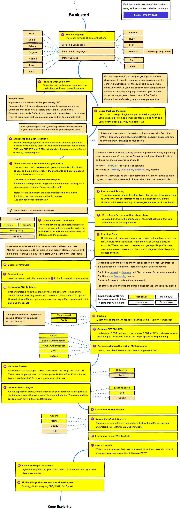

# Back-end

- [Frontend Developer](https://github.com/kamranahmedse/developer-roadmap)
- [Web Developer Roadmap 2018 が 2019 年版になっていたので比較してみる | Qiita](https://qiita.com/ushironoko/items/a2420cf4a28af56907e5)

## TOC

- Language：Nodejs、TypeScript
- Package Manager：NPM、Yarn
- Testing
- Relational Database：MySQL
- NoSQL Database：MongoDB
- Framework：Express（Node.js）
- Caching：Memcached、Redis
- API：RESTful API
- Authorization：OAuth
- Web Server：Nginx

## Roadmap

