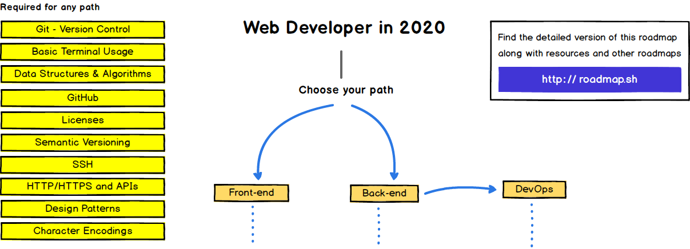

# Common

## Roadmap

Ref : [Web Developer Roadmap - 2020](https://github.com/kamranahmedse/developer-roadmap/)

## TOC

- Version Control
  - [x] [Git](./Common/Git.md)
- Basic Terminal Usage
  - [x] [Linux](./Common/Linux.md)
  - [x] [Fish](./Common/fish.md)
  - [x] [Starship](./Common/Starship.md)
  - [x] [WSL](./Common/WSL.md)
- Data Structures & Algorithms
- GitHub
- Licenses
- Semantic Versioning
- SSH
- HTTP/HTTPS and APIs
- Design Principles
- Design Patterns
  - [x] [SOLID / KISS / YAGNI](./Common/DesignPrinciples.md)
  - [x] [Design Patterns](./Common/DesignPatterns.md)
  - [x] [CleanArchitecture](./Common/CleanArchitecture.md)
- Character Encodings
