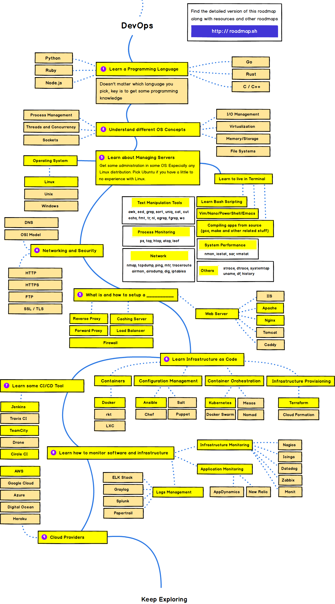

# DevOps

- [Frontend Developer](https://github.com/kamranahmedse/developer-roadmap)
- [Web Developer Roadmap 2018 が 2019 年版になっていたので比較してみる | Qiita](https://qiita.com/ushironoko/items/a2420cf4a28af56907e5)

## TOC

- Network & Security：HTTP / HTTPS、FTP、SSL / TLS
- Infrastracture as Code
  - Container：Docker、Docker Compose
  - Container Orchestration：Kubernetes
  - Configration Management：Ansible
  - Provisioning：Terraform
  - CI / CD：Circle CI
  - Cloud：AWS

## Roadmap

