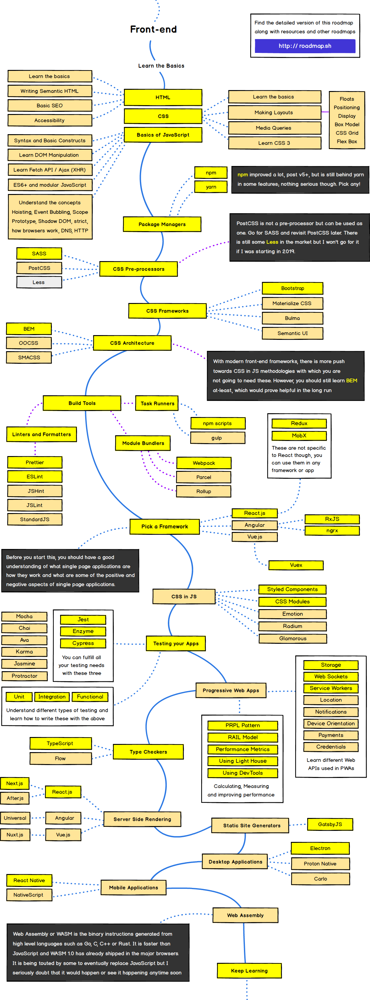

# Front-end

- [Frontend Developer](https://github.com/kamranahmedse/developer-roadmap)
- [Web Developer Roadmap 2018 が 2019 年版になっていたので比較してみる | Qiita](https://qiita.com/ushironoko/items/a2420cf4a28af56907e5)

## TOC

- Language：HTML、CSS、JavaScript
- CSS Pre-processors：SASS
- CSS Frameworks：Bootstrap
- CSS Architecture：BEM
- Build Tools
  - Linter & Formatters：Prettier / ESLint
  - Module Bundlers：Webpack
  - Task Runners：npm scripts
- Testing：Jest, Enzyme, Cypress
- Type Scheckers：TypeScript
- Framework：Vue / Vuex、React / Redux
- SSR（Server Side Rendering）：Nuxt（Vue）、Next（React）

## Roadmap

